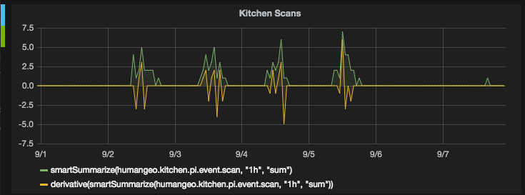

# skupi

## Advanced Kitchen Analytics
> scan **all** the things



In 2014 I set up a cheap (~$30) USB barcode scanner to a Raspberry Pi in our office kitchen and asked anyone who took a soda to scan the UPC. I wrote `scand.py` to listen for events from the scanner and deposit them in a local sqlite database plus a graphite server for visualization. 

There was no real purpose to this scanner other than to collect data for use in the visualization tool. Once the office caught on to it, hilarity ensued. It wasn't long before some cleve hackers figured out how to make their own barcodes, and then it was just a matter of hours before [Aru](https://github.com/arusahni) tried to sql inject it. The code, it turns out, is safe from that.

## Config
Copy scand.cfg.sample to scand.cfg and enter graphite details for best results
```bash
$ cp scand.cfg.sample scand.cfg
```

You'll probably need to change SCANNER_NAME in scand.py so that the daemon can find your scanner.
